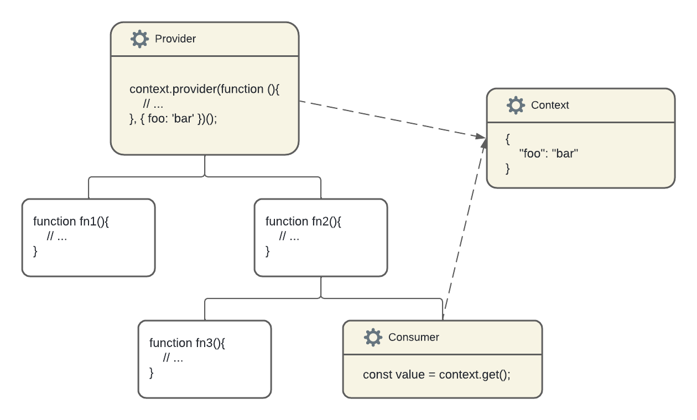

# fn-context

O `fn-context` é um pacote que fornece um contexto de execução para funções no Node.js. Ele é útil para funções que precisam de um contexto de processo. Ou seja, não importa o quão profundo você chame uma função, o contexto de execução será o mesmo para cada processo de forma individual. O contexto é usado para gerenciar dados globais, por exemplo, estado global, serviços, configurações de usuário e muito mais.

**Índice**

- [fn-context](#fn-context)
  - [Como usar o contexto](#como-usar-o-contexto)
    - [1. Criando o contexto](#1-criando-o-contexto)
    - [2. Fornecendo o contexto](#2-fornecendo-o-contexto)
    - [3. Consumindo o contexto](#3-consumindo-o-contexto)
  - [Quando você precisa de contexto?](#quando-você-precisa-de-contexto)
    - [Exemplo:](#exemplo)
  - [Instalação](#instalação)
  - [API](#api)
    - [`createContext`](#createcontext)
    - [Options](#options)
    - [`context.provider`](#contextprovider)
    - [`context.get`](#contextget)
    - [`context.set`](#contextset)
    - [`context.id`](#contextid)
    - [`context.value`](#contextvalue)
    - [`context.cache`](#contextcache)
    - [`context.cache.has`](#contextcachehas)
    - [`context.cache.get`](#contextcacheget)
    - [`context.cache.set`](#contextcacheset)
    - [`context.cache.delete`](#contextcachedelete)
    - [`context.cache.clear`](#contextcacheclear)

## Como usar o contexto

Usar o contexto no `fn-context` requer 3 etapas simples: criar o contexto, fornecer o contexto e consumir o contexto.

### 1. Criando o contexto

A função de fábrica integrada `createContext(default)` cria uma instância de contexto:

```ts
// context.js
import { createContext } from 'react';

export const Context = createContext('Default Value');
```

A função de fábrica aceita um argumento opcional: o valor padrão. Se você não fornecer um valor padrão, o valor padrão será `undefined`.

### 2. Fornecendo o contexto

A propriedade `provider` disponível na instância de contexto é usado para fornecer o contexto para as funções chamadas no escopo, não importa quão profundos eles estejam. 

É uma função que requer dois argumentos:

- `target`: a função que será executada.
- `defaultValue`: o valor padrão do contexto para a função `target`, argumento opcional. Se não for definido, o valor padrão do contexto será o valor definido no `createContext`.

```ts
// index.js
import { Context } from './context';

const fn = async () => {
  console.log(Context.get()); // 'Default Value'
};

await Context.provider(fn)();
```

O que é importante aqui é que todos as funções que desejam consumir o contexto mais tarde devem estar envoltos dentro do escopo `provider`.

### 3. Consumindo o contexto

Consumir o contexto pode ser feito de 2 maneiras.

A primeira maneira recomendada, é usar a propriedade `get` disponível na instância de contexto:

```ts
// index.js
import { Context } from './context';

const fn = async () => {
  console.log(Context.get()); // 'Default Value'
};

await Context.provider(fn)();
```

A segunda maneira é usar a propriedade `value` disponível na instância de contexto:

```ts
// index.js
import { Context } from './context';

const fn = async () => {
  console.log(Context.value); // 'Default Value'
};

await Context.provider(fn)();
```

Em caso que deseja alterar o valor do contexto, você pode usar a propriedade `set` disponível na instância de contexto, ou, mudar diretamente o valor da propriedade `value`:

```ts
// index.js
import { Context } from './context';

const fn = async () => {
  Context.set('New Value');
  // ou
  // Context.value = 'New Value';
  console.log(Context.get()); // 'New Value'
};

await Context.provider(fn)();
```



Você pode ter quantos consumidores quiser para um único contexto. Se o valor do contexto mudar (alterando a propriedade `value` na instância de contexto), todos os consumidores recebem o valor atualizado. Se o valor do contexto mudar dentro de um consumidor, todos os outros consumidores recebem o valor atualizado.

Se o consumidor não estiver envolto dentro do provedor, mas ainda tentar acessar o valor do contexto, então o valor do contexto será o valor padrão fornecido como argumento para a função fábrica `createContext(defaultValue)` que criou o contexto.

## Quando você precisa de contexto?

A principal ideia de usar o contexto é permitir que seus processos acessem dados globais e repassem quando esses dados globais forem alterados. O contexto resolve o problema de perfuração de props: quando você precisa passar props dos pais para os filhos.

Você pode manter dentro do contexto:

- estado global
- configuração da aplicação
- nome do usuário autenticado
- configurações do usuário
- idioma preferido
- uma coleção de serviços
- *... e muito mais*

Por outro lado, você deve pensar cuidadosamente antes de decidir usar contexto em sua aplicação.

Primeiro, integrar o contexto adiciona complexidade. Criar um contexto, envolver tudo em um provedor e usar `value` em cada consumidor — aumenta a complexidade.

Em segundo lugar, adicionar contexto complica o teste unitário dos processos. Durante os testes, você terá que envolver as funções consumidores em um provedor de contexto. Incluindo as funções que são afetados indiretamente pelo contexto — os ancestrais dos consumidores de contexto!

Imagine-se uma situação onde você tem uma função que precisa de um contexto unificado para cada processo de forma individual. O `fn-context` permite que você defina um contexto de execução para cada função e fornece uma maneira de acessar esse contexto de execução em qualquer lugar da função ou qualquer outra função que você chame dentro do escopo do contexto inicializado anteriormente, como o `context.provider`.

### Exemplo:

```ts
import { createContext } from 'fn-context';

const context = createContext();

const fn = async () => {
  const fn2 = async () => {
    console.log(context.get()); // { foo: 'bar' }
  };

  await fn2();
};

await context.provider(fn, { foo: 'bar' })();
```

Neste exemplo, a função `fn2` acessa o contexto de execução definido pela função `fn`. Isso é útil quando você precisa de um contexto de execução unificado para cada função.

Também funciona em caso de funções aninhadas:

```ts
import { createContext } from 'fn-context';

const context = createContext();

const fn = async () => {
  const fn2 = async () => {
    const fn3 = async () => {
      console.log(context.get()); // { foo: 'bar' }
    };

    await fn3();
  };

  await fn2();
};

await context.provider(fn, { foo: 'bar' })();
```

Ou fora de escopo:

```ts
import { createContext } from 'fn-context';

const context = createContext();

const fn2 = async () => {
  console.log(context.get()); // { foo: 'bar' }
};

const fn = async () => {
  await fn2();
};

await context.provider(fn, { foo: 'bar' })();
```

Neste exemplo, a função `fn2` acessa o contexto mesmo que não esteja dentro do escopo da função `fn`. Porém, esse método só funcionará se a função `fn2` for chamada dentro do escopo da função `fn` onde foi definido o contexto com o uso do `context.provider`. Caso contrário, o contexto não será acessível e retornará o valor padrão pré-definido no `createContext`.

É importante que saiba que o contexto é definido apenas para a função que o inicializou. Se você chamar a função `fn` em outro lugar, o contexto não será acessível e/ou retornará o valor padrão pré-definido no `createContext`, como no exemplo abaixo:

```ts
import { createContext } from 'fn-context';

const context = createContext();

const fn = async () => {
  console.log(context.get());
};

await context.provider(fn, { foo: 'bar' })();
await fn(); // O contexto não será acessível
```

É possível realizar exportação e importação do contexto para outras funções:

```ts
// context.ts
import { createContext } from 'fn-context';
export const context = createContext();
```

```ts
// fn.ts
import { context } from './context';

export const fn2 = async () => {
  context.set({ foo: 'bar', bar: 'foo' });
};

export const fn3 = async ()=>{
  console.log(context.get()); // { foo: 'bar', bar: 'foo' }
}
```

```ts
// index.ts
import { context } from './context';
import { fn2, fn3 } from './fn';

const fn = context.provider(async () => {
  fn2();
  fn3();
}, { foo: 'bar' });

await fn();
```

É possível criar vários contextos de execução para a mesma função ou funções diferentes:

```ts
import { createContext } from 'fn-context';

const context1 = createContext();
const context2 = createContext();

const fn = async () => {
  console.log(context1.get()); // { foo: 'bar' }
  console.log(context2.get()); // { bar: 'foo' }
};

await context2.provider(context1.provider(fn, { foo: 'bar' }), { bar: 'foo' })();
```

Uma coisa que é preciso resaltar é que, contextualizando uma função, o que se espera é que, o valor do contexto seja único para cada processo iniciado. Ou seja, se você chamar a função `fn` duas vezes, o contexto será diferente para as duas chamadas. Isso é útil para funções que precisam de um contexto de execução unificado para cada processo de forma individual.

```ts
import { createContext } from 'fn-context';

const context = createContext({ foo: 'bar' });

const fn2 = async ()=>{
  const valor = context.get();
  context.set({...valor, time: Date.now()});
}

const fn3 = async ()=>{
  return context.get();
}

const fn = async ()=>{
  await fn2();
  return await fn3();
};

context.provider(fn)().then(console.log); // { foo: 'bar', time: 1633661600000 }
context.provider(fn, { bar: 'foo' })().then(console.log); // { bar: 'foo', time: 1633661601000 }
```

O `fn-context` foi pensado para uso de contextualização em desenvolvimento de APIs, inclusivemente, para o Express.js. Ou seja, conxteualizar o request para uso em várias funções que não fazem parte do escopo do request. Exemplo:

```ts
// context.ts
import { createContext } from 'fn-context';

export const reqContext = createContext({ req: null, res: null });
```

```ts
// controller.ts
import { reqContext } from './context';

export const getUser = async () => {
  const {req} = reqContext.get();
  
  if(!req.body.user){
    req.body.user = "admin";
    req.body.id = reqContext.id;
  }
  
  return req.body.user;
};

export const controller = async () => {
  const {req} = reqContext.get();
  
  if(!req.body){
    req.body = {};
  }
  
  await getUser();
  
  return req.body;
};
```

```ts
// index.ts
import express from 'express';
import { reqContext } from './context';
import { controller } from './controller';

const app = express();

app.get('/', reqContext.provider(async (req, res) => {
  reqContext.set({req, res});
  res.json(await controller());
}));

app.listen(3000, () => {
  console.log('Server is running on port 3000');
});
```

## Instalação

```bash
npm install fn-context
```

ou

```bash
yarn add fn-context
```

## API

### `createContext`

```ts
/**
 * @template T - O tipo do valor padrão do contexto.
 * @template C - O tipo cache do contexto, que deve ser um objeto. Por padrão, é um objeto genérico com chaves do tipo string e valores de qualquer tipo. Útil apenas em casos específicos onde você deseja armazenar valores em cache no contexto.
 * @param defaultValue - O valor padrão do contexto.
 * @returns Um novo contexto de execução.
 */
createContext<T, C extends Object = { [key: string]: any;}>(defaultValue?: T): Context<T>;
```

Propriedade responsável por criar um novo contexto de execução.

```ts
import { createContext } from 'fn-context';

const context = createContext();
```

### Options

- `individual`: Se definido como `true`, o contexto será individual para cada processo iniciado. Ou seja, se você chamar a função `fn` duas vezes, uma dentro da outra, mas com o mesmo contexto, o conteúdo do contexto será diferente para as duas chamadas. Isso é útil uma situação que precise de um contexto diferente do antecessor. Se como `false`, será considerado o conteúdo do contexto do antecessor. Útil em situações em que precisa de um contexto global para todas as funções chamadas. Por padrão, é `false`.

```ts
import { createContext } from 'fn-context';

const context = createContext({ foo: 'bar' }, { individual: true });
```

### `context.provider`

```ts
/**
 * @template A - O tipo dos argumentos da função.
 * @template R - O tipo de retorno da função.
 * @param target - A função que será executada.
 * @param defaultValue - O valor padrão do contexto para a função `target`. Se não for definido, o valor padrão do contexto será o valor definido no `createContext`.
 * @returns Uma função que executa a função `target` com o contexto definido.
 */
provider<A extends any[], R = any | void>(target: (...args: A) => Promise<R> | R, defaultValue: T) => (...args: A) => Promise<R>;
```

Propriedade responsável por fornecer um contexto de execução para uma função.

```ts
import { createContext } from 'fn-context';

const context = createContext();

const fn = async () => {
  console.log(context.get());
};

await context.provider(fn, { foo: 'bar' })();
```

### `context.get`

```ts
/**
 * @template T - O tipo do valor do contexto.
 * @returns O valor do contexto.
 */
get(): T;
```

Propriedade responsável por obter o valor do contexto.

```ts
import { createContext } from 'fn-context';

const context = createContext();

console.log(context.get());
```

### `context.set`

```ts
/**
 * @template T - O tipo do valor do contexto.
 * @param value - O valor do contexto.
 */
set(value: T): void;
```

Propriedade responsável por definir o valor do contexto.

```ts
import { createContext } from 'fn-context';

const context = createContext();

context.set({ foo: 'bar' });
```

### `context.id`

```ts
/**
 * @returns O ID do contexto.
 */
id: string;
```

Propriedade responsável por obter o ID do contexto.

```ts
import { createContext } from 'fn-context';

const context = createContext();

console.log(context.id);
```

### `context.value`

```ts
/**
 * @template T - O tipo do valor do contexto.
 * @returns O valor do contexto.
 */
value: T;
```

Propriedade responsável por obter e definir o valor do contexto.

```ts
import { createContext } from 'fn-context';

const context = createContext();

console.log(context.value); // undefined
context.value = { foo: 'bar' };
console.log(context.value); // { foo: 'bar' }
```

### `context.cache`

```ts
/**
 * @template C - O tipo cache do contexto, que deve ser um objeto. Por padrão, é um objeto genérico com chaves do tipo string e valores de qualquer tipo. Útil apenas em casos específicos onde você deseja armazenar valores em cache no contexto.
 * @returns O cache do contexto.
 */
cache: C;
```

Propriedade responsável por obter e definir valores no cache do contexto.

```ts
import { createContext } from 'fn-context';

const context = createContext();

console.log(context.cache.has("foo")); // false
```

### `context.cache.has`

```ts
/**
 * @param key - A chave do cache.
 * @returns Se a chave existe no cache.
 */
cache.has(key: string): boolean;
```

Propriedade responsável por verificar se uma chave existe no cache do contexto.

```ts
import { createContext } from 'fn-context';

const context = createContext();

console.log(context.cache.has("foo")); // false
```

### `context.cache.get`

```ts
/**
 * @param key - A chave do cache.
 * @returns O valor da chave no cache.
 */
cache.get(key: string): any;
```

Propriedade responsável por obter um valor do cache do contexto.

```ts
import { createContext } from 'fn-context';

const context = createContext();

console.log(context.cache.get("foo")); // undefined
```

### `context.cache.set`

```ts
/**
 * @param key - A chave do cache.
 * @param value - O valor da chave no cache.
 */
cache.set(key: string, value: any): void;
```

Propriedade responsável por definir um valor no cache do contexto.

```ts
import { createContext } from 'fn-context';

const context = createContext();

context.cache.set("foo", "bar");
console.log(context.cache.get("foo")); // bar
```

### `context.cache.delete`

```ts
/**
 * @param key - A chave do cache.
 */
cache.delete(key: string): void;
```

Propriedade responsável por deletar um valor do cache do contexto.

```ts
import { createContext } from 'fn-context';

const context = createContext();

context.cache.set("foo", "bar");
console.log(context.cache.get("foo")); // bar
context.cache.delete("foo");
console.log(context.cache.get("foo")); // undefined
```

### `context.cache.clear`

```ts
/**
 * Limpa o cache do contexto.
 */
cache.clear(): void;
```

Propriedade responsável por limpar o cache do contexto.

```ts
import { createContext } from 'fn-context';

const context = createContext();

context.cache.set("foo", "bar");
console.log(context.cache.get("foo")); // bar
context.cache.clear();
console.log(context.cache.get("foo")); // undefined
```
